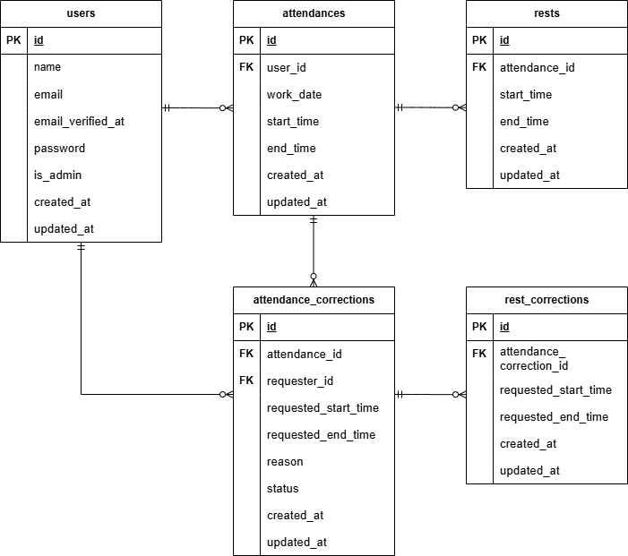

# Onoe-Attendance

シンプルさを追求した勤怠管理アプリケーションです。

## 環境構築

### 前提条件
- Git
- Docker

### 1. Dockerビルド

```bash
# リポジトリをクローン
git clone git@github.com:yoshi-bell/Onoe-Attendance.git

# プロジェクトディレクトリに移動
cd Onoe-Attendance

# Dockerコンテナをビルドしてバックグラウンドで起動
docker-compose up -d --build

※MySQLは、OSによって起動しない場合があるのでそれぞれのPCに合わせて`docker-compose.yml`ファイルを編集してください。
```

### 2. Laravel環境構築

```bash
# PHPコンテナに入る
docker-compose exec php bash

# --- これ以降はPHPコンテナ内で実行 ---

# パッケージのインストール
composer install

# .env.exampleファイルをコピーし.envファイルを作成後、環境変数を変更
cp .env.example .env

# アプリケーションキーの生成
php artisan key:generate

# データベースのマイグレーションと初期データ投入
php artisan migrate:fresh --seed

※シーディングにより、管理者ユーザー1件、一般ユーザー5件のダミーデータがデータベースに入力されます。

#（任意）storageディレクトリの権限設定
"The stream or file could not be opened"エラーが発生した場合に実行し権限を変更します。
chmod -R 777 storage

"注意": "777"は全てのユーザーに読み書き実行を許可する最も緩い権限設定です。これはローカル開発環境での権限問題を簡易的に解決するためのもので、本番環境では使用しないでください。

# --- PHPコンテナから出るには `exit` と入力してください ---
# (または Ctrl + D)

# --- これ以降はホストOSのターミナルで実行 ---
# Dockerを再起動し.envファイルの変更を反映
docker-compose restart
```

セットアップ完了後、 `http://localhost` でアプリケーションにアクセスできます。

## アプリケーションの機能

- **認証機能 (一般ユーザー・管理者)**
    - Laravel Fortifyを利用したログイン、会員登録、ログアウト機能。
    - Eメールによる本人確認（メール認証）機能。

- **勤怠打刻機能**
    - ユーザーは出勤、退勤、休憩開始、休憩終了の打刻ができます。
    - 現在のステータス（勤務中、休憩中など）がリアルタイムで反映されます。

- **勤怠記録の表示**
    - **一般ユーザー:** 自身の勤怠記録を月別カレンダー形式で確認できます。
    - **管理者:** 全ユーザーの勤怠状況を日別一覧で確認できます。 選択した特定スタッフスタッフの月別勤怠記録の閲覧もできます。

- **勤怠修正機能**
    - **一般ユーザー:** 過去の勤怠記録に対して勤怠詳細画面を表示でき、そこから修正申請を送信できます。
    - **管理者:** ユーザーからの修正申請を一覧で確認し、承認または却下できます。一般ユーザーと同じように過去の勤怠記録に対して勤怠詳細画面を表示でき、管理者はそこから直接編集することも可能です。
    - `注意: 当日のデータへの勤怠詳細画面へ遷移する「詳細ボタン」は押せない仕様となっています。`
    - `詳細ボタンや修正の動作については、下記のテストユーザーでログインしご確認ください。`

- **スタッフ管理機能 (管理者)**
    - 登録されている全一般ユーザーの情報を一覧で確認できます。


## 使用技術
- PHP 8.1
- Laravel 8.x (8.75+)
- MySQL 8.0.26
- Docker
- Laravel Fortify (認証基盤)
- MailHog (メールテスト用ツール)

## ER図



## URL一覧
- **アプリケーション (トップ):** `http://localhost/`
- **会員登録:** `http://localhost/register`
- **ログイン:** `http://localhost/login`
- **勤怠打刻 (ユーザー):** `http://localhost/attendance`
- **勤怠一覧 (ユーザー):** `http://localhost/attendance/list`
- **管理者ログイン:** `http://localhost/admin/login`
- **勤怠一覧 (管理者):** `http://localhost/admin/attendance/list`
- **スタッフ一覧 (管理者):** `http://localhost/admin/staff/list`
- **phpMyAdmin:** `http://localhost:8080/`
- **MailHog (テスト用メール受信箱):** `http://localhost:8025/`

## テストユーザー

シーディングにより、以下のテスト用アカウントが作成されます。

- **管理者ユーザー**
  - **メールアドレス:**
     - `admin@example.com`
  - **パスワード:**
     - `adminpass`

- **一般ユーザー 30名**
  - **メールアドレス:test{user_id}@example.comという形で連番になっています。**
    - `test1@example.com` ～ `test30@example.com`
  - **一般ユーザー共通パスワード:**
    - `usertest`

## テスト

PHPUnitによるフィーチャーテストが用意されています。

### テスト環境の構築

テストは開発用データベースから隔離された専用のテストデータベースで実行されます。

1.  **テスト用データベースの作成**

    ```bash
    # MySQLコンテナ内で `onoe_attendance_test` データベースを作成
    docker compose exec mysql mysql -u root -p -e "CREATE DATABASE onoe_attendance_test;"
    ```

    コマンド実行後、パスワードの入力を求められます。
    `docker-compose.yml` に定義されている `MYSQL_ROOT_PASSWORD` の値（デフォルトでは `root`）を入力してください。

2.  **テスト用環境ファイルの作成**

    ```bash
    # PHPコンテナに入る
    docker compose exec php bash

    # --- これ以降はPHPコンテナ内で実行 ---

    # .env.testing ファイルを作成
    cp .env .env.testing
    ```

3.  **テスト用環境変数の設定**

    作成した`.env.testing`ファイル内の以下の項目をテスト用の下記の値に編集します。

    ```dotenv
    APP_ENV=testing

    DB_CONNECTION=mysql_test
    DB_DATABASE=onoe_attendance_test
    DB_USERNAME=root
    DB_PASSWORD=root
    ```

4.  **テスト用設定の反映**

    ```bash
    # テスト環境用のアプリケーションキーを生成
    php artisan key:generate --env=testing

    # 設定キャッシュをクリア
    php artisan config:clear

    # テストデータベースにテーブルを作成
    php artisan migrate --env=testing
    ```

### テストの実行

```bash
# PHPコンテナに入る
docker-compose exec php bash

# --- これ以降はPHPコンテナ内で実行 ---

# 全てのテストを実行
php artisan test

# 特定のテストファイルを実行
php artisan test tests/Feature/AdminStaffListTest.php
```